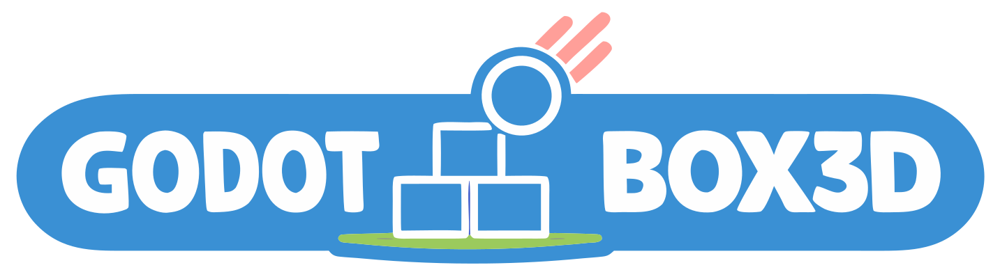

<p align="center">
  
</p>

# Box3D for Godot

A **[Godot 4](https://godotengine.org) GDExtension** that embeds
**[Box3D](https://github.com/erincatto/box3d)** Erin Catto's 3D rigid-body
physics engine and exposes it as ready-to-use nodes: `Box3DWorld`,
`Box3DBody`, the joints, and a character controller.

This is a fork of **[erincatto/box3d](https://github.com/erincatto/box3d)**. The
upstream engine sources are unchanged; everything Godot-specific lives in
**[`godot/`](godot/)**. The original Box3D README is preserved [below](#box3d).

> ⚠️ **Very early / experimental.** Box3D itself is v0.1.0 and this binding is
> young expect rough edges, missing pieces, and API churn. It's not
> production-ready; it's a starting point to build on.

### What's here

- Targets **Godot 4.7**. One-command build (`scons`) compiles Box3D from source
  into the extension no prebuilt engine binary required.
- **Full API parity with upstream Box3D.** Twenty registered classes cover
  worlds; static/kinematic/dynamic bodies; box/sphere/capsule/cylinder/cone/
  convex-hull/triangle-mesh/height-field colliders; the full joint set (hinge,
  slider, distance, ball, fixed, motor, wheel, parallel, filter); contact &
  sensor events; ray/shape/overlap queries; a character controller; continuous
  collision; and live solver tuning. Every class carries **in-editor
  documentation**, so F1 in the script editor answers for the binding the way
  it does for a built-in node.
- Ships a **sample browser** demo (65 samples stacks, ragdoll, a drivable
  car, joints, queries, and toys).
- Runs on **Android** (arm64 + x86_64), verified on real hardware under
  Vulkan, with touch controls and a mobile-scaled UI in the demo. Build and
  toolchain walkthrough: **[`godot/ANDROID_BUILD.md`](godot/ANDROID_BUILD.md)**.

**New in 0.4.x**, on top of the API surface above:

- **Recording and replay.** `Box3DRecording` captures a world's steps and
  `Box3DReplayPlayer` stands them back up. Box3D hashes the world after every
  step and replay recompares, so replaying at a *different* worker count is a
  live cross-thread determinism check rather than a playback feature.
- **Contact rule tables.** `Box3DContactRules` is a data table that overrides
  the solver's four contact callbacks: never-collide pairs, one-way platforms,
  and friction and restitution mixing. The callbacks run on worker threads
  where a GDScript `Callable` would be unsafe, so script authors data and C++
  evaluates it on the hot path with no allocation and no lock.
- **A debug draw overlay** that renders the solver's own view of the world:
  shapes, contacts, joints and sleep state, straight out of Box3D.
- **A character mover with spring suspension**, ported number for number from
  upstream's `mover.cpp`, plus a third-person follow camera shared with the Car
  sample.
- **`Box3DGeometry` and `Box3DCollision`**, two static toolboxes exposing
  Box3D's geometry and collision routines on their own, with no world required.


<p align="center">
  
</p>


https://github.com/user-attachments/assets/b3b04613-ed57-417e-822d-665f057b7d5c


https://github.com/user-attachments/assets/33752918-c3a2-4899-821c-bf13d9adce11


### Try it in a browser first

**[Play it on itch.io](https://stinkysunstep.itch.io/box3d-godot)** -- the demo
in a browser, no download, multi-threaded solver, full-size scenes. Desktop,
Android and iOS all run that threaded build there. Both browser builds are also
downloadable from [Releases](https://github.com/Stink-O/box3d-godot/releases)
if you want to host your own; the single-threaded one is the one to pick for a
plain static host, which cannot send the headers the threaded build needs.

**It is a preview, not the real thing.** Running the demo in Godot is the
intended way and the only one that shows the binding at full speed. The browser
build is slower on purpose and by circumstance: WebAssembly costs something over
native, and it renders through the Compatibility (WebGL2) renderer because
Godot 4.7 has no WebGPU. Judge performance from a desktop run, not from the
page. Determinism on wasm is also unverified, so the browser build is not a
reference for behaviour.

## Getting started

Never used a Godot GDExtension before? This walks the whole way, from nothing
installed to a crate falling onto a floor. **You do not need a compiler.** The
extension is a small prebuilt library that you download and drop into a folder.
Building it yourself is optional and covered in
[Building](godot/README.md#building).

### Step 1: install Godot 4.7

Download it from [godotengine.org/download](https://godotengine.org/download).
Godot is a single executable with no installer: unzip it and run it. The normal
(non-.NET) download is the simplest choice.

**The version matters.** This extension declares a minimum of Godot 4.7, so
4.6 and earlier will refuse to load it. If in doubt, check `Help > About` in
the editor.

### Step 2: get this repository

Either clone it:

```sh
git clone https://github.com/Stink-O/box3d-godot
```

or, if you do not use git, open the
[repository page](https://github.com/Stink-O/box3d-godot), click the green
**Code** button and choose **Download ZIP**, then unzip it somewhere.

### Step 3: download the library for your platform

Go to [Releases](https://github.com/Stink-O/box3d-godot/releases), open the
newest one and look under **Assets**. Download the files for your system:

| Your system | Files to download |
| --- | --- |
| Windows | `libbox3d_godot.windows.template_debug.x86_64.dll` and `libbox3d_godot.windows.template_release.x86_64.dll` |
| Linux | `libbox3d_godot.linux.template_debug.x86_64.so` and `libbox3d_godot.linux.template_release.x86_64.so` |
| macOS | Not prebuilt. Play the [browser demo](https://stinkysunstep.itch.io/box3d-godot), or [build from source](godot/README.md#building). |

**Why two files?** The `template_debug` one is what the Godot editor itself
loads, so it is the one you need to press play. The `template_release` one is
used when you export a finished game. Grab both now and you will not have to
come back for the second one later.

The `android` and `web` files in the same list are only needed if you later
export your game to a phone or to a web page. You can ignore them for now.

Windows note: the DLLs are cross-compiled from Linux and have never been run on
Windows by the author. They may work fine, but they are untested. If Windows
SmartScreen or your antivirus flags a downloaded DLL, that is the usual
unsigned-binary warning rather than a sign of a problem.

### Step 4: put the files where Godot looks for them

Copy the files you downloaded into this folder inside the repository:

```
box3d-godot/godot/demo/bin/
```

That folder already exists and already contains a file called
`box3d.gdextension`. That file is the manifest: it tells Godot which library to
load for which platform, so **do not rename or delete it**, and do not rename
the libraries either. The names have to match what the manifest expects,
character for character.

When you are done the folder looks roughly like this (Linux shown):

```
godot/demo/bin/
  box3d.gdextension
  libbox3d_godot.linux.template_debug.x86_64.so
  libbox3d_godot.linux.template_release.x86_64.so
```

### Step 5: open the project

Start Godot. On the Project Manager screen click **Import**, browse to
`box3d-godot/godot/demo/project.godot`, and open it. Godot will import the
assets once, which takes a moment the first time.

### Step 6: press play

Hit **F5** (or the play button, top right). The demo opens on its first sample.
The **Samples** button in the top bar drops down the full list, grouped by
category: stacks, a ragdoll, a drivable car, joints, queries, and the toys.

The controls worth knowing straight away:

- **Left-click and drag** grabs a body at the exact point you clicked and lets
  you throw it. While holding one, the **scroll wheel** reels it closer or
  pushes it further away.
- **Hold right mouse** to fly the camera with **W A S D**, plus **Q** and **E**
  for down and up, and **Shift** to move faster.
- **Hold F** to charge a shot and release to fire a ball from the camera. The
  longer you hold, the harder it goes.
- The **Settings** button opens a panel on the right. Its engine selector
  reruns the same sample on **Godot Physics** or **Jolt** instead of Box3D,
  which is the quickest way to see what the binding is actually doing.

## Add Box3D to your own project

Once the demo runs, using the extension in a project of your own is four steps.

**1. Make a `bin` folder** at the root of your project, next to your
`project.godot`.

**2. Copy two things into it:** the library files you downloaded, and the
`box3d.gdextension` file from `godot/demo/bin/`. The manifest looks for the
libraries at `res://bin/`, so keeping the folder named exactly `bin` means you
do not have to edit anything. (If you prefer a different layout, edit the paths
inside `box3d.gdextension` to match.)

**3. Restart Godot.** Extensions are loaded at startup, so a project that was
already open will not see a newly added one until you close and reopen it.

**4. Check that it worked.** Add a new node and type `Box3DWorld` into the
search box. If it appears, the extension is loaded. If it does not, see the
troubleshooting table below.

Now make something fall. Create a `Node3D`, attach this script, and press play:

```gdscript
extends Node3D

func _ready() -> void:
    # Everything physical has to live under a Box3DWorld.
    var world := Box3DWorld.new()
    add_child(world)

    var ground := Box3DBody.new()
    ground.body_type = Box3DBody.STATIC   # static bodies never move
    ground.box_size = Vector3(20, 1, 20)
    ground.position = Vector3(0, -0.5, 0)
    ground.auto_visual = true             # give it a mesh so you can see it
    world.add_child(ground)

    var crate := Box3DBody.new()          # dynamic is the default
    crate.position = Vector3(0, 5, 0)
    crate.auto_visual = true
    world.add_child(crate)
```

You will need a `Camera3D` pointed at the origin to see it, and a light such as
a `DirectionalLight3D` so the shapes are not flat black. `auto_visual` is a
convenience that generates a mesh matching the collider, which is handy while
learning; for real work you add your own `MeshInstance3D` children.

From here, [`godot/README.md`](godot/README.md) documents every node, property
and joint.

## If something goes wrong

| What you see | What it usually means |
| --- | --- |
| `Box3DWorld` is not in the node list | The library is missing, in the wrong folder, or renamed. Check that the files sit next to `box3d.gdextension` and that their names are unchanged. Restart Godot after adding them. |
| An error about the extension needing a newer version | You are on Godot 4.6 or earlier. Install 4.7. |
| It works in the editor but the exported game crashes on start | The `template_release` library is missing. Export uses that one, the editor uses `template_debug`. |
| Godot loads but every sample is empty | The project was opened before the library was added. Close the project and reopen it. |
| Nothing at all happens on macOS | There is no prebuilt macOS library. Build from source or use the browser demo. |
| A downloaded `.dll` is flagged by antivirus | Expected for unsigned binaries. These particular DLLs are also untested on Windows. |

**→ Full docs:** see **[`godot/README.md`](godot/README.md)**.

Inspired by the [`box3d-unity`](https://github.com/timskap/box3d-unity) binding,
which does the same for Unity.

---

<sub>The rest of this file is the upstream Box3D README.</sub>

# Box3D

[](https://github.com/erincatto/box3d/actions)
[](https://cla-assistant.io/erincatto/box3d)


Box3D is a 3D physics engine for games.

[](https://www.youtube.com/watch?v=jr_Fzl2XwKU)

## Features

### Collision

- Continuous collision detection
- Contact events
- Convex hulls, capsules, spheres, triangle meshes, and height fields
- Multiple shapes per body
- Collision filtering
- Ray casts, shape casts, and overlap queries
- Sensor system
- Character mover

### Physics

- Robust _Soft Step_ rigid body solver
- Continuous physics for fast translations and rotations
- Island based sleep
- Revolute, prismatic, distance, motor, weld, and wheel joints
- Joint limits, motors, springs, and friction
- Joint and contact forces
- Body movement events and sleep notification

### System

- Data-oriented design
- Written in portable C17
- Extensive multithreading and SIMD
- Optimized for large piles of bodies
- Cross platform determinism
- Recording and replay

### Samples

- Uses sokol to run with D3D11 on Windows, Metal on macOS, and OpenGL 4.5 on Linux.
- Graphical user interface with imgui.
- Many samples to demonstrate features and performance.

## Building all platforms

- Install [CMake](https://cmake.org/)
- Install [git](https://git-scm.com/)
- Ensure these run from the command line

## Building with CMake presets (recommended)

This uses the presets in `CMakePresets.json`.

- Windows: `cmake --preset windows` then `cmake --build --preset windows-release`
- Linux: `cmake --preset linux-release` then `cmake --build --preset linux-release`
- macOS: `cmake --preset macos` then `cmake --build --preset macos-release`
- Windows MinGW: `cmake --preset mingw-release` then `cmake --build --preset mingw-release`

Run the samples app (must be in the Box3D directory).

- Windows: `.\build\bin\Release\samples.exe`
- Linux: `./build/bin/samples`
- macOS: `./build/bin/Release/samples`

## Building for Visual Studio

- Install [Visual Studio](https://visualstudio.microsoft.com/)
- Run `build_vs2026.bat`
- Open and build `build/box3d.slnx`

## Building for Linux

- Run `build.sh` from a bash shell
- Results are in the build sub-folder

## Building for Xcode

- mkdir build
- cd build
- cmake -G Xcode ..
- Open `box3d.xcodeproj`
- Select the samples scheme
- Build and run the samples

## Building for Web

- [Emscripten SDK](https://emscripten.org/docs/getting_started/downloads.html)
- `emcmake cmake -B build -DBOX3D_SAMPLES=OFF`
- `cmake --build build`

Box3D uses SSE2 with WebAssembly. Define `BOX3D_DISABLE_SIMD` to disable SSE2.

## Building and installing

- mkdir build
- cd build
- cmake ..
- cmake --build . --config Release
- cmake --install . (might need sudo)

## Using Box3D in your project

The core library has no dependencies beyond the C runtime (and `libm` on Unix). Linking it
gives you the `box3d::box3d` target.

I recommend to use FetchContent:

```cmake
include(FetchContent)
FetchContent_Declare(box3d
  GIT_REPOSITORY https://github.com/erincatto/box3d.git
  GIT_TAG v0.1.0)
FetchContent_MakeAvailable(box3d)

target_link_libraries(my_app PRIVATE box3d::box3d)
```

For a vendored copy or git submodule, point `add_subdirectory` at it:

```cmake
add_subdirectory(extern/box3d)

target_link_libraries(my_app PRIVATE box3d::box3d)
```

To use a copy installed with `cmake --install`, find the package:

```cmake
find_package(box3d 0.1 REQUIRED)

target_link_libraries(my_app PRIVATE box3d::box3d)
```

See [`docs/hello.md`](docs/hello.md) for a minimal first program.

## Compatibility

The Box3D library and samples build and run on Windows, Linux, and Mac.

You will need a compiler that supports C17 to build the Box3D library.

You will need a compiler that supports C++20 to build the samples.

Box3D uses SSE2 and Neon SIMD math to improve performance. SIMD can be disabled by defining `BOX3D_DISABLE_SIMD`.

## Documentation

The user manual lives in [`docs/`](docs/) and is built with Doxygen. Enable the `BOX3D_DOCS` CMake option and build the `doc` target.

## Community

- [Discord](https://discord.gg/NKYgCBP)

## Contributing

Pull requests are currently disabled. Instead, please file an issue for bugs or feature requests. For support, please visit the Discord server.

## Giving feedback

Please file an issue or start a chat on discord. You can also use [GitHub Discussions](https://github.com/erincatto/box3d/discussions).

## License

Box3D is developed by Erin Catto and uses the [MIT license](https://en.wikipedia.org/wiki/MIT_License).

## Sponsorship

Support development of Box3D through [Github Sponsors](https://github.com/sponsors/erincatto).

Please consider starring this repository and subscribing to my [YouTube channel](https://www.youtube.com/@erin_catto).

## LLM Usage

LLMs are used in the following areas:

- unit tests
- samples app
- migrating code between Box2D and Box3D
- build configuration
- code reviews
- benchmarking

Elsewhere all code is developed and written by me. I take responsibility for every line of code in Box2D/3D.
